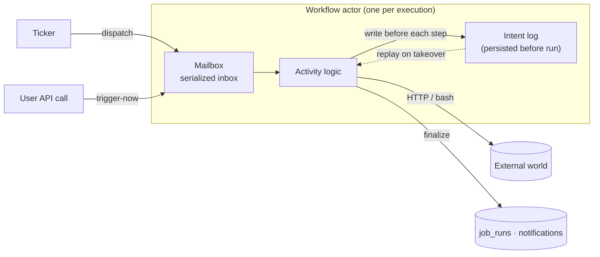
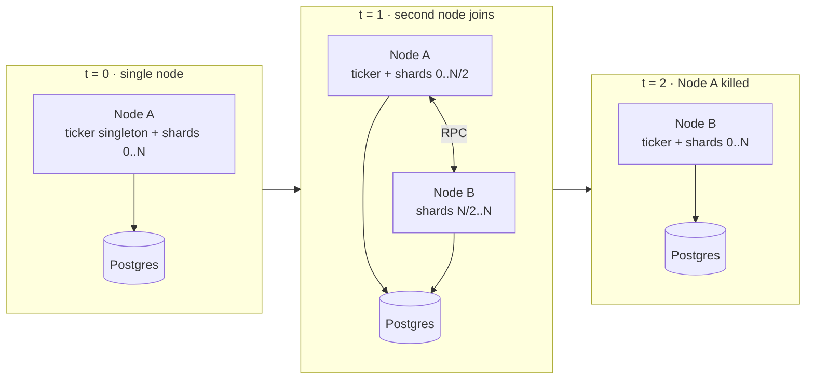

# Chronos


A distributed job scheduling system. You submit a job, it runs at the time
you asked for, it tells you what happened, and it survives the machine it
was running on dying. This document explains how it does that and why the
design is the way it is.

Built as a response to the Airtribe Backend Engineering Launchpad case
study.

## The architectural bet

Most job schedulers are a cron service that polls a database. Chronos is
not that. Every running job in Chronos is an actor in the sense Carl
Hewitt described in 1973: a process that owns its state, processes
messages in order from a mailbox, and persists what it intends to do
before it does it. I wrote about why that model matters in
[Rethinking Backend Architecture: A Requiem of Processes and Data](https://blog.aryank.space/articles/rethinking-backend-architecture-for-a-requiem-of-processes-and-data).

The implementation rides on `@effect/cluster`, which is an honest actor
runtime: sharded entities, mailboxes, peer RPC over msgpack, durable
workflows. A running job lives inside a shard. Messages to that job are
routed by shard id over TCP between nodes. The mailbox serializes writes
so two messages can't race on the same workflow. Before each activity
runs, its intent is persisted to Postgres. If the node holding the shard
dies, another node takes the shard, reads the persisted intents, and
resumes from the last completed step instead of starting from scratch.



This is what makes Chronos distributed in a way that means something,
rather than "we put it behind a load balancer."

## How the Airtribe brief maps to the code

**Job submission.** The HTTP API at `src/jobs/http.ts` accepts both
one-time and recurring jobs. One-time uses a `runAt` timestamp.
Recurring uses a standard cron expression. Both land in the same `jobs`
table and the ticker picks them up when their `nextRunAt` is due. There
is no separate queueing service. Postgres is the queue.

**Recurring jobs.** Cron is parsed with `croner`. After a recurring job
fires, the ticker computes the next run inside the same transaction
that dispatched the current one (`src/ticker/ticker.ts:38-44`). This
matters: a node crashing in the middle of dispatch cannot lose the next
schedule. It's either committed with the dispatch or rolled back
together.

**Job management.** REST endpoints for list, view, pause, resume,
cancel, and trigger-now. Versioned at `/api/v1/...`. Authentication
goes through Better Auth, with sessions stored in Postgres. Every job
is owned by a user, and every query filters by that owner.

**Failure handling.** Every job has a `retryPolicy` JSONB column
(`src/db/schema.ts:39-43`). On failure the workflow activity retries
under an exponential schedule with optional jitter, capped at
`maxAttempts`. After final failure the workflow inserts a row into the
`notifications` table so the owner sees it the next time they hit the
UI. Failures don't break the system. They become data.

**Logging and monitoring.** Every run becomes a `job_runs` row with
stdout, stderr, exit code (for bash) or HTTP response status and body
(for webhooks), error message, attempt number, started_at, finished_at.
There is a `/health` endpoint that runs `SELECT 1`. The cluster runner
logs its own peer registry events on boot.

## What makes it special

A few things, said plainly.

It uses a real actor runtime, not a hand-rolled one. `@effect/cluster`
gives us sharded entities, durable workflows, mailbox semantics, peer
RPC, runner health checks, and singleton election as library code we
don't own. Most "distributed" backends paper over concurrency in the
application tier with locks and idempotency keys. Chronos pushes it
down to the framework where it belongs, and the framework was written
by people who care about the right semantics.

Workflows replay, they don't restart. A bash job that wrote 5MB of
stdout and crashed at minute 3 of a 5 minute script doesn't re-run from
minute zero on the new node. It re-runs the failed activity. The
persisted intent log makes this possible. This is the durable execution
property that Temporal and Cloudflare Durable Objects also give you,
and it's the whole reason for the existence of the actor model in
practice.

There is exactly one coordinator, and it is Postgres. No Redis, no
Kafka, no Zookeeper, no etcd. Runners register themselves in a Postgres
table. Shard ownership is held by Postgres advisory locks that drop the
instant the connection dies. Workflow messages persist before they ack.
If you can run Postgres in HA, you can run Chronos in HA. If your
Postgres dies, your cluster goes idle and resumes cleanly when it comes
back. That's the entire story.

Multi-node coordination is honest, and we tested it. Two Chronos
processes pointed at the same Postgres will not double-fire jobs and
will not both run the ticker. The first process boots, claims the
ticker singleton, ticks. A second process boots, registers as a
healthy runner, takes shards for workflow execution, and leaves the
ticker alone. Kill the first, the second elects itself ticker within
the lock expiration window. No coordination service, no leader
election library, no manual failover.



The bash sandbox is real but small, and we say so. We use `just-bash`
which gives an egress URL allowlist and env scoping. That is not a
microVM and we don't pretend it is. For dedicated bash workers the
recommended path is a shard group so bash execution lands only on
machines provisioned for it. True isolation (Firecracker, gVisor, per
job container) is a separate workstream from clustering and lives on
the roadmap, not in the code today.

The code is small. The server is one Bun process. Types are checked
end to end. Errors are typed through Effect, including the cluster
layer. Adding a new kind of job is one new workflow file and one
annotation. There is no glue layer between "we accepted the job" and
"we ran the job," because both halves are part of the same Effect
program.

## Trade-offs we accepted on purpose

Durability costs a write. Every activity persists its intent before it
runs. That is throughput we will never get back, in exchange for the
ability to lose a node and not lose work. For a job scheduler this is
the right trade. For a 100k QPS event firehose it would be the wrong
trade. Chronos is not pretending to be a stream processor.

Postgres is a coupling we chose. The blog post argues that having one
home for concurrency, consistency, and failure is more valuable than
spreading those concerns across three different systems. The same
argument applies here. Yes, Postgres is a single point of dependency.
Yes, it would be nicer if it were free. No, we don't think Redis plus
Kafka plus a coordination service is better just because the diagram
has more boxes.

Bash is multi-tenant by host, not by job. Until a `bash` shard group is
used to isolate bash workers, scripts share a node with the API. This
is acceptable for an internal tool and a known gap for an open SaaS.

## Tech stack

Bun runtime. Effect for everything (errors, layers, schemas, retries,
durations). `@effect/cluster` for actors, sharding, durable workflows.
`@effect/sql-pg` and Drizzle ORM for Postgres. Better Auth for sessions.
`croner` for cron parsing. `just-bash` for sandboxed bash execution.
React plus shadcn for the dashboard. One Postgres container in
docker-compose for dev.

## Running it

One Postgres, one or more Chronos nodes.

```
docker compose up -d postgres
bun run db:push
bun src/main.ts
```

Two nodes on one machine:

```
PORT=3000 RUNNER_PORT=34430 bun src/main.ts
PORT=3001 RUNNER_PORT=34431 bun src/main.ts
```

For production, set `RUNNER_HOST` per node to the address peers can
route to, set `DATABASE_URL` to your managed Postgres, and put the
HTTP API behind your load balancer. That is the entire deployment
checklist.

For the deeper operational story (how shard locks expire, what happens
under partition, what to set per node) see
[DISTRIBUTED.md](./DISTRIBUTED.md).

## Repository layout

```
src/
  main.ts            entrypoint, layer composition
  db/                Drizzle schema + Postgres client
  jobs/              job CRUD repo + HTTP routes
  runs/              job_runs repo + HTTP routes
  notifications/     notification repo + HTTP routes
  workflows/         bash + webhook workflow definitions
  ticker/            singleton claim-and-dispatch loop
  auth/              Better Auth integration
web/                 React + shadcn dashboard
docker-compose.yml   single Postgres for dev
```

## Assessment notes

Functionality: every requirement in the Airtribe brief is implemented
and exercised. Submission (one-time and recurring), management (list /
view / pause / resume / cancel / trigger-now), retries with exponential
backoff and jitter, notifications on final failure, per-run logs with
stdout / stderr / exit code, and a health endpoint.

Code quality: the backend is small, typed, and uses Effect's error
channel rather than throws. Comments are reserved for non-obvious
invariants (the deliberate `SKIP LOCKED` alongside the singleton, for
example) and not used to narrate code.

Design: the system commits to one architectural idea (actors plus a
single Postgres coordinator) and follows it through. There are no
incidental services. There is no glue. The same primitives that make
single-node correctness work also make multi-node correctness work.

Documentation: this file, `DISTRIBUTED.md`, the `PRD.md` that drove the
design, the `README.md` for usage, and a recorded explainer video.
