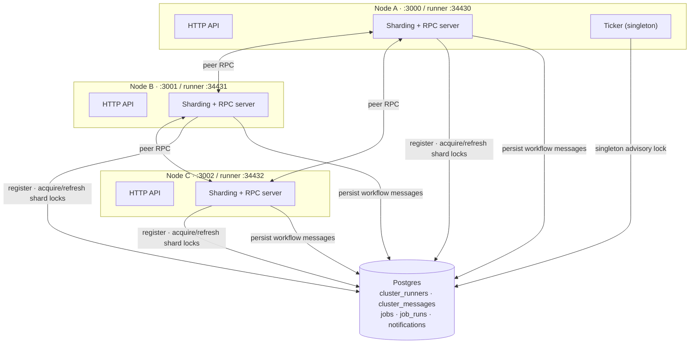
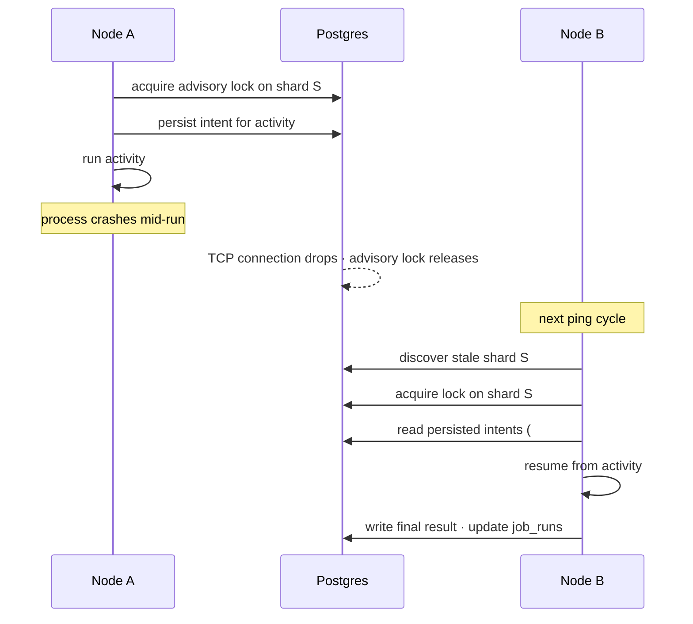

# Chronos distribution model

## The model

Chronos is an actor system. Every running workflow is an entity inside an
`@effect/cluster` shard. It owns its state, it processes messages from a
mailbox in order, and it persists its intent to Postgres before each step.
If the node holding the shard dies, the next runner reads the persisted
intents and resumes from the last completed step instead of starting over.

Carl Hewitt described this model in 1973. I wrote about why it still
matters in [Rethinking Backend Architecture: A Requiem of Processes and
Data](https://blog.aryank.space/articles/rethinking-backend-architecture-for-a-requiem-of-processes-and-data).
The rest of this document is the operational side: what runs where, how
nodes coordinate, what fails how.

## What runs where

Every Chronos process is identical. There is no "scheduler node" vs.
"worker node" distinction at the binary level. The same `bun src/main.ts`
runs everywhere. Differentiation happens at runtime through shard
assignment and singleton election, both arbitrated by Postgres.

A node does three things. It serves HTTP. It runs cluster entities
(workflows). And on exactly one node at a time, it runs the ticker. The
HTTP layer is stateless and can sit behind any load balancer. The cluster
entities are sharded across healthy runners. The ticker is registered as
`Singleton.make("chronos-ticker", ...)` and is the only piece that is
logically single-threaded across the whole fleet.

## How coordination works



`BunClusterSocket.layer({ storage: "sql" })` provides four things.

A TCP socket server bound to `RUNNER_HOST:RUNNER_PORT`. Peers reach this
address via msgpack RPC to deliver workflow messages to whichever runner
currently owns the relevant shard.

`SqlRunnerStorage`, a Postgres table where each booting process inserts
itself as a runner and acquires Postgres advisory locks on shard ids it
owns. Locks refresh on an interval (`shardLockRefreshInterval`) and
expire if the holder dies (`shardLockExpiration`). Because they are
advisory locks, a hard-killed Postgres connection drops the lock
immediately.

`RunnerHealth.layerPing`, which makes every node ping every other node it
knows of. Unresponsive peers get their shards reassigned to survivors.

`SqlMessageStorage`, which persists workflow messages to Postgres before
they ack. A runner dying mid-execution doesn't lose work. The message
gets picked up by whoever owns the shard next.

No Zookeeper, no etcd, no Consul, no Raft. Postgres is the truth.

## Ticker semantics

The ticker still does `SELECT … FOR UPDATE SKIP LOCKED`
(`src/ticker/ticker.ts:30`) even though the singleton wrapper ensures only
one node runs it. This is deliberate. During a failover window two nodes
can briefly believe they own the singleton, and `SKIP LOCKED` makes that
benign instead of a double-fire.

Cron jobs whose `nextRunAt` has passed get claimed in a transaction,
their next run is computed and written back, and they are dispatched as
workflows. Once the workflow leaves the ticker's hands, sharding takes
over and the actual bash or webhook execution lands wherever the shard
for that `executionId` lives.

## What's still single-node

Postgres. The `docker-compose.yml` runs one container with one volume.
The moment Postgres goes down, no node can elect singletons, refresh
shard locks, or persist workflow messages, so the cluster goes idle.
Production fix is RDS Multi-AZ, Cloud SQL HA, or self-hosted Patroni.
The code does not change.

Bash execution shares the host with the API. A `BashJob` runs on
whichever runner owns its shard via `just-bash`, which gives env scoping
and an egress URL allowlist but is not process isolation. The blast
radius is the host. To shrink it, introduce a shard group (say `"bash"`),
annotate `BashJob` with `ClusterSchema.ShardGroup → "bash"`, and only
include `"bash"` in the `shardGroups` env of dedicated worker nodes.
Then bash execution is physically confined to those hosts. Real
isolation (Firecracker, gVisor, per-job container) is a separate
workstream from clustering.

## Running N nodes

Required per node.

- `DATABASE_URL`, the same Postgres for every node.
- `RUNNER_HOST`, the address peer nodes use to reach this one. Default
  `127.0.0.1` is fine for a single-host dev cluster. In production set
  it to the interface that other nodes can route to.
- `RUNNER_PORT`, unique per process on a shared host. Defaults to
  `34430`.
- `PORT`, the HTTP port for that node's API, usually behind a load
  balancer.

Optional. `SHARD_GROUPS=default,bash` to opt a node into a non-default
shard group. `SHARDS_PER_GROUP` to widen the shard space.

A two-node smoke test on one machine is one command per terminal:

```
PORT=3000 RUNNER_PORT=34430 bun src/main.ts
PORT=3001 RUNNER_PORT=34431 bun src/main.ts
```

Both register, both serve HTTP, only one ticks.

## Failure and replay



## Failure cases worth knowing

A network partition between two nodes that share Postgres: each can
still refresh its own shard locks, so neither loses ownership. Workflow
messages destined for the unreachable peer's shards retry until the
partition heals or the peer's lease expires.

A Postgres flap: shard lock refreshes fail. Once `shardLockExpiration`
passes, surviving nodes re-acquire and resume. In-flight workflow
activities replay from the last persisted step.

A node OOM kill: the advisory lock drops with the connection. Shard
reassignment happens within one ping interval.

Two nodes booted with the same `RUNNER_PORT` on the same host: the
second `bind()` fails on boot. This is loud and immediate, not silent
corruption.

## Files touched in this migration

- `src/main.ts:1-13`, imports: drop `SingleRunner`, add
  `BunClusterSocket`, `RunnerAddress`, `Singleton`, `Option`.
- `src/main.ts:67-79`, `ShardingLive` (BunClusterSocket with explicit
  runner address) and `ClusterLive` (workflow engine over sharding).
- `src/main.ts:81`, `TickerSingleton`.
- `src/main.ts:83-97`, layer composition switched from `mergeAll` to a
  `provideMerge` chain so the ticker singleton can resolve its
  `Sharding`, `WorkflowEngine`, and `JobRunsRepo` dependencies.
- `src/main.ts:92-97`, `Effect.forkDaemon(tickerLoop)` removed. The
  singleton layer registers the loop.
