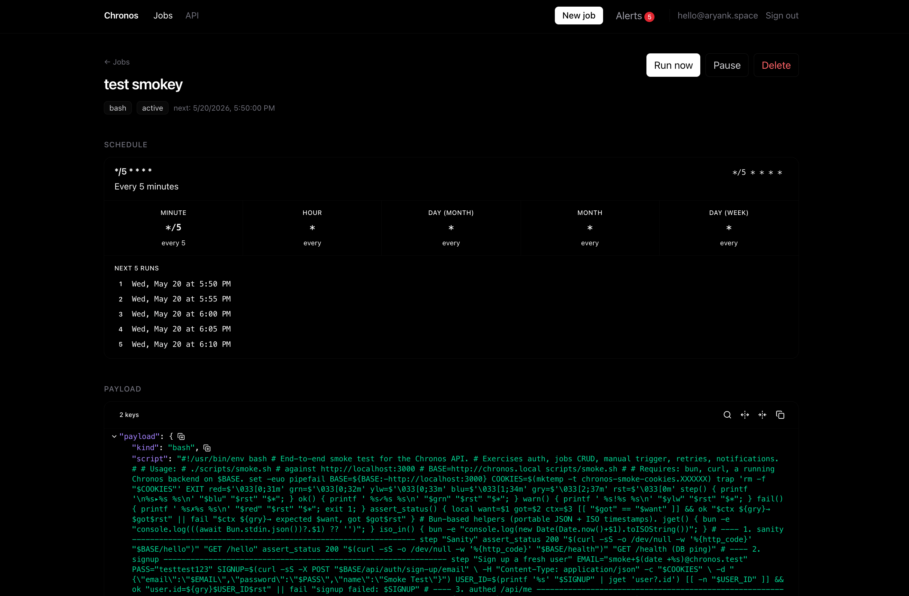
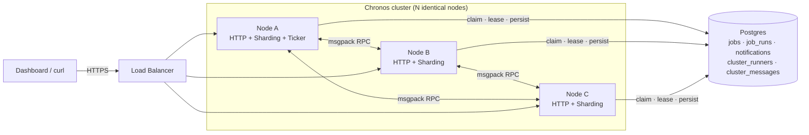
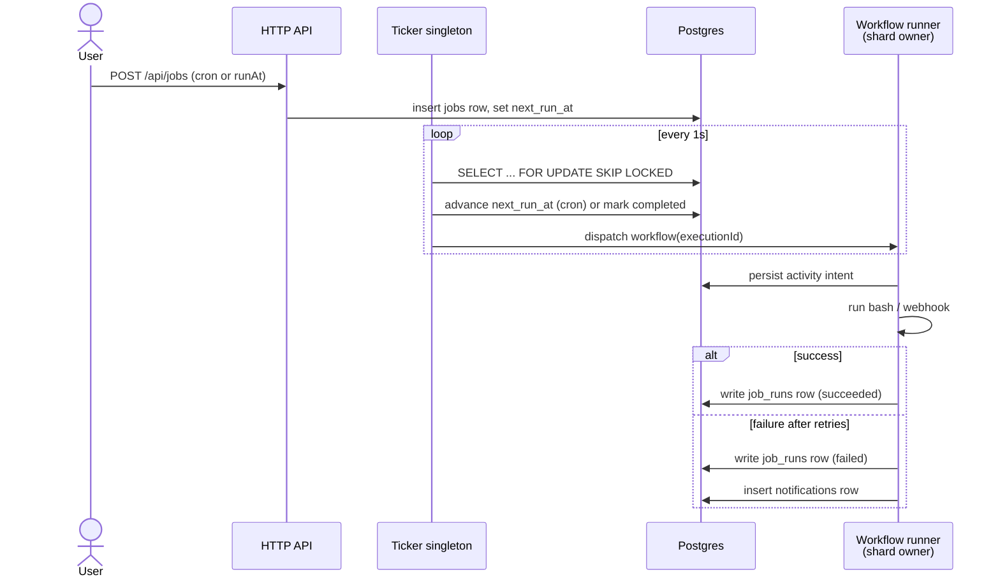

# Chronos



A distributed job scheduler. Submit one-time or recurring jobs that fire as **webhook calls** or **sandboxed bash scripts**, with durable execution, automatic retries, full per-run logs, and in-app notifications when retries are exhausted.

Built for the Airtribe Backend Engineering Launchpad case study.

> **Docs map**
> [`PRD.md`](./PRD.md) for the original design doc (data model, decisions log).
> [`DISTRIBUTED.md`](./DISTRIBUTED.md) for the operational story (multi-node coordination, shard locks, failure modes).
> [`CASE_STUDY.md`](./CASE_STUDY.md) for the case-study response (architecture, trade-offs, what makes Chronos special).

## Stack

| Layer | Choice |
|---|---|
| Runtime | Bun |
| Language | TypeScript (strict) |
| Effect system | `effect@3.x` (typed errors, layered DI, schedules for retry) |
| Durable workflows | `@effect/workflow` + `@effect/cluster` (sharded multi-runner cluster on Postgres, with singleton election) |
| DB | Postgres 16 (Docker) |
| ORM | Drizzle ORM `1.0-beta` via `drizzle-orm/effect-postgres` adapter |
| HTTP server | `@effect/platform-bun` HttpServer |
| Inter-node RPC | msgpack over TCP, via `@effect/platform-bun/BunClusterSocket` |
| Auth | Better Auth (email + password) |
| Sandbox (bash mode) | `just-bash` (in-process virtual filesystem with network allowlist) |
| Cron parser | `croner` |
| Frontend | Vite + React 19 + TypeScript + Tailwind v4 + TanStack Query + React Router + shadcn (`@jalco` registry components) |

## Quick start

Prerequisites: **Bun ≥ 1.3**, **Docker Desktop**.

```bash
# 1. install deps
bun install
cd web && bun install && cd ..

# 2. start Postgres
bun run db:up

# 3. apply our domain schema (jobs/job_runs/notifications)
bun run db:push

# 4. apply Better Auth schema (user/session/account/verification)
bunx @better-auth/cli@latest migrate --config src/auth/better-auth.ts --yes

# 5. run the backend
bun run dev               # http://localhost:3000

# 6. (separate terminal) run the dashboard
cd web && bun dev         # http://localhost:5173, Vite proxies /api/* to :3000
```

Default Postgres credentials live in `.env.example`. Copy to `.env`:

```bash
cp .env.example .env
# then generate a session secret:
openssl rand -base64 32  # paste into BETTER_AUTH_SECRET
```

The `@effect/cluster` workflow storage tables (`cluster_messages`, `cluster_runners`, etc.) self-bootstrap on first server boot. No manual step needed.

## Running multiple nodes

Every Chronos process is identical. Point N processes at the same Postgres, give each a unique `RUNNER_PORT`, and they register as a cluster automatically. Two nodes on one machine:

```bash
PORT=3000 RUNNER_PORT=34430 bun run start
PORT=3001 RUNNER_PORT=34431 bun run start
```

Only one node runs the ticker (singleton election via Postgres advisory lock). Workflow execution is sharded across all healthy runners. Kill any node and its shards reassign to survivors inside the lock expiration window. For production, set `RUNNER_HOST` on each node to the address peers can route to, and put the HTTP API behind a load balancer. See [`DISTRIBUTED.md`](./DISTRIBUTED.md) for partition behavior, shard groups, and the full env-var contract.

## Architecture

Chronos is an actor system. Every running job is a workflow entity inside an `@effect/cluster` shard. A **ticker singleton** (one node, elected via Postgres advisory lock) polls every second for jobs whose `next_run_at <= now()`, claims them with `SELECT ... FOR UPDATE SKIP LOCKED`, and dispatches each as a **workflow execution** routed by shard id to whichever node owns the shard. The workflow engine persists each activity's intent to Postgres before running it, so a process crash resumes from the last completed step on whichever runner takes over the shard. The activity itself runs the work (HTTP fetch or `just-bash` exec), retries internally with exponential backoff and jitter, and on terminal failure inserts a `notifications` row that the UI polls every 30 seconds.

The conceptual framing (workflow as actor, intent log, single-authority coordination) is written up in [Rethinking Backend Architecture: A Requiem of Processes and Data](https://blog.aryank.space/articles/rethinking-backend-architecture-for-a-requiem-of-processes-and-data).

### System view



### Job lifecycle



## API at a glance

All `/api/jobs/*`, `/api/runs/*`, `/api/notifications/*` routes require a Better Auth session cookie. The dashboard's **/api-ref** page renders these tables interactively with type-coloured props (powered by the `@jalco/api-ref-table` component).

| Method | Path | Purpose |
|---|---|---|
| ALL | `/api/auth/*` | Better Auth (sign-up, sign-in, sign-out, session) |
| POST | `/api/jobs` | Create job |
| GET | `/api/jobs` | List user's jobs (paginated) |
| GET | `/api/jobs/:id` | Job detail |
| PATCH | `/api/jobs/:id` | Edit (name, payload, schedule, retry policy, pause/active) |
| DELETE | `/api/jobs/:id` | Cancel and delete (cascades to runs and notifications) |
| POST | `/api/jobs/:id/run` | Manually trigger now |
| GET | `/api/jobs/:id/runs` | Run history |
| GET | `/api/runs/:id` | Run detail with full logs |
| GET | `/api/notifications` | List notifications, `?unseenOnly=true` filter |
| GET | `/api/notifications/unseen-count` | For the UI badge |
| POST | `/api/notifications/:id/seen` | Mark as read |

### Request shapes

**Create a one-time webhook job:**

```bash
curl -X POST http://localhost:3000/api/jobs \
  -H "Content-Type: application/json" -b cookies.txt \
  -d '{
    "name": "ping httpbin",
    "payload": {
      "kind": "webhook",
      "url": "https://httpbin.org/get",
      "method": "GET"
    },
    "schedule": { "runAt": "2026-05-20T14:00:00Z" }
  }'
```

**Create a recurring bash job:**

```bash
curl -X POST http://localhost:3000/api/jobs \
  -H "Content-Type: application/json" -b cookies.txt \
  -d '{
    "name": "daily report",
    "payload": {
      "kind": "bash",
      "script": "echo hello | tr a-z A-Z",
      "timeoutMs": 30000,
      "allowedUrls": []
    },
    "schedule": { "cron": "0 9 * * *" },
    "retryPolicy": { "maxAttempts": 3, "baseMs": 1000, "maxMs": 60000, "jitter": true }
  }'
```

## Key design decisions

These are the calls worth flagging in a code review. Deeper reasoning lives in [`PRD.md`](./PRD.md) §12 and the architectural framing in [`CASE_STUDY.md`](./CASE_STUDY.md).

1. **Effect Workflow as the durable execution primitive, not a hand-rolled retry loop.** Retries, state survival across crashes, and idempotency are exactly what workflow engines exist to solve. Building them by hand would reimplement well-trodden ground. The actor framing makes the math of crash recovery a property of the framework, not the application.
2. **Job-row plus workflow-per-execution model, NOT one long-lived looping workflow per job.** The case study describes a *scheduler* (users manage jobs, view runs, reschedule). A `jobs` row driving a per-tick workflow maps cleanly to that user-facing model. Cleaner cancel and reschedule semantics.
3. **Sharded multi-runner cluster on Postgres, with singleton election for the ticker.** Multiple nodes register in `cluster_runners`, take shard ownership via Postgres advisory locks, and route workflow messages to each other over msgpack RPC. The ticker is wrapped in `Singleton.make` so exactly one node ticks. `SELECT ... FOR UPDATE SKIP LOCKED` stays in the claim path as belt-and-suspenders during failover windows.
4. **`just-bash` for shell jobs, not Docker-per-job.** In-process virtual FS, no container spin-up cost (about 100 ms saved per execution), no Docker daemon dependency, network defaults off with per-job allowlist. Real isolation without extra ops surface. For dedicated bash workers, opt into a shard group so bash execution lands only on nodes provisioned for it.
5. **Better Auth, not hand-rolled JWT.** Owns its own tables in Postgres, plays with Bun, sessions plus cookies plus CSRF handled out of the box. About 20 lines of glue to wrap into an Effect `Auth.requireUser` service.
6. **Drizzle ORM 1.0-beta via `effect-postgres`, layered on top of `@effect/sql-pg`.** Type-safe queries (refactor safety, IDE autocomplete), shared connection pool, `drizzle-kit push` for schema sync. Beta channel, because the adapter only exists on 1.0-beta.

## What's not built (intentional)

- Email and SMS notifications (in-app DB-table notifications only).
- OAuth, magic links, passkeys, 2FA.
- Per-attempt run rows. Retries happen internally inside the workflow, and one `job_runs` row per workflow execution captures the final outcome.
- Multi-tenant orgs and role-based auth. Per-user scoping only.
- Job dependencies, DAGs, fan-out.
- Bash per-job isolation (Firecracker, gVisor, per-job container). Current sandboxing is `just-bash` virtual FS plus egress allowlist. Multi-node bash execution is supported via shard groups, but per-job isolation lives on the roadmap, not in the code today.

## Operating notes and gotchas

- **Don't use `bun --hot` with this app.** `@effect/cluster`'s message processor captures references during layer construction, so partial reloads leave the cluster engine in an inconsistent state where workflows register but no live worker picks them up. The `dev` script uses `bun --watch` (full restart) for that reason.
- **Cluster owns its schema.** Don't try to manage `cluster_*` tables with `drizzle-kit`. The `tablesFilter` in `drizzle.config.ts` scopes drizzle-kit to our owned tables only (`jobs`, `job_runs`, `notifications`).
- **Better Auth runs its config under `process.env`, not `Bun.env`.** Their CLI uses jiti (Node-based) to load the config file, and using `Bun.env` would crash the migrate command.
- **just-bash sandboxing.** Bash jobs run in an in-process virtual filesystem with **no network access by default**. To allow specific URLs, pass `allowedUrls: ["https://api.example.com"]` in the bash payload. For production multi-tenant, add SSRF blocking for private IP ranges plus AWS metadata endpoint.
- **just-bash execution limits.** The Bash sandbox has runtime safety caps to prevent runaway compute. We raise them above the library defaults (10k commands / loop iterations) to 1,000,000 each, tunable via `BASH_MAX_COMMANDS` and `BASH_MAX_LOOPS` env vars. If you see `bash: too many commands executed (>X)`, bump those.
- **`RUNNER_PORT` must be unique per process on a shared host.** Two nodes booting with the same runner port will fail `bind()` on the second one. Loud and immediate, not silent corruption.

## Repository layout

```
chronos/
├── docker-compose.yml          # Postgres 16
├── drizzle.config.ts           # drizzle-kit config (tablesFilter scoped)
├── src/
│   ├── main.ts                 # entrypoint: HTTP server, ticker singleton, cluster runtime
│   ├── db/
│   │   ├── client.ts           # PgClient + Drizzle Db layer
│   │   └── schema.ts           # Drizzle schema
│   ├── auth/                   # Better Auth config + Effect Auth service
│   ├── jobs/                   # CRUD HTTP routes, repo, Effect Schema
│   ├── runs/                   # read routes + repo + Schema
│   ├── notifications/          # read routes + repo + Schema
│   ├── ticker/                 # claim loop (FOR UPDATE SKIP LOCKED), wrapped in Singleton
│   └── workflows/              # WebhookJob + BashJob + dispatch
├── web/                        # Vite + React + Tailwind + shadcn dashboard
├── scripts/                    # smoke.sh end-to-end check
├── PRD.md                      # original design doc
├── DISTRIBUTED.md              # operational story for multi-node
└── CASE_STUDY.md               # case-study response
```

## Scripts

```bash
# backend
bun run dev          # bun --watch src/main.ts (auto-restart on change)
bun run start        # plain bun src/main.ts
bun run typecheck    # tsc --noEmit

# database
bun run db:up        # docker compose up -d postgres
bun run db:down
bun run db:logs
bun run db:push      # drizzle-kit push (sync schema)
bun run db:generate  # drizzle-kit generate (create versioned migration)
bun run db:studio    # drizzle-kit studio (DB GUI)

# frontend
cd web
bun dev              # Vite dev server with /api proxy
bun run build        # tsc -b && vite build
```

## License

MIT

## Submissions by [Aryan Kathawale](https:tldr.aryank.space)
